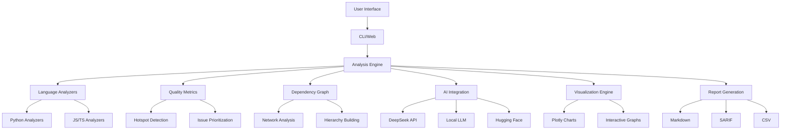

# 🚀 Code Quality Intelligence Agent (MVP)

<div align="center">


**An AI-powered agent that analyzes multi-language codebases, identifies quality issues, and produces actionable reports with explanations, fix suggestions, prioritization, hotspots, and interactive Q&A over the codebase.**

[🎯 Features](#-features) • [⚡ Quick Start](#-quick-start) • [🔧 Setup](#-setup) • [📖 Usage](#-usage) • [🤖 AI Integration](#-ai-integration) • [🚀 Deployment](#-deployment) • [🤝 Contributing](#-contributing)

</div>

---

## 📋 Table of Contents

- [📚 Architecture](#-architecture)
- [🎯 Features](#-features)
- [⚡ Quick Start](#-quick-start)
- [🎥 Explanation Video](#-explanation-video)
- [🔧 Setup](#-setup)
- [📖 Usage](#-usage)
- [🤖 AI Integration](#-ai-integration)
- [🎨 Web Interface](#-web-interface)
- [🔌 CLI Commands](#-cli-commands)
- [📊 Visualizations](#-visualizations)
- [🚀 Deployment](#-deployment)
- [🤝 Contributing](#-contributing)
- [🔧 Troubleshooting](#-troubleshooting)
- [📄 License](#-license)

---

---

## 📚 Architecture

### 🏗️ **System Architecture**



## 🎯 Features

### 🔍 **Multi-Language Analysis**
- **Python**: Ruff, Bandit, Radon analysis
- **JavaScript/TypeScript**: ESLint with security plugins
- **Smart Detection**: Automatic language detection and appropriate tooling

### 🤖 **AI-Powered Intelligence**
- **DeepSeek Integration**: Remote AI for advanced analysis
- **Local LLM Fallback**: Offline AI using Hugging Face models
- **Smart Severity Scoring**: AI-enhanced issue prioritization
- **Conversational Q&A**: Natural language codebase exploration

### 📊 **Advanced Visualizations**
- **Interactive Charts**: Plotly-powered dashboards
- **Dependency Graphs**: Network analysis and hierarchy visualization
- **Hotspot Analysis**: Code complexity and churn heatmaps
- **Trend Analysis**: Quality metrics over time

### ⚡ **Performance Optimized**
- **Incremental Caching**: Smart file change detection
- **Parallel Processing**: Multi-threaded analysis
- **Sampling Tiers**: Efficient large repository handling
- **Fast Mode**: Optimized for 1000+ file repositories

### 🛠️ **Developer Experience**
- **Modern Web UI**: Streamlit with glassmorphism design
- **CLI Interface**: Command-line tool for CI/CD integration
- **Autofix Capabilities**: Safe automated code improvements
- **Export Options**: Markdown, SARIF, CSV reports

---

## ⚡ Quick Start

### 🐍 **Prerequisites**
- Python 3.11 or higher
- Git (for repository analysis)
- 4GB+ RAM (for AI features)

### 📦 **Installation**

```bash
# Clone the repository
git clone https://github.com/Blacksujit/Code-Quality-Intelligent_Agent
cd code-quality-agent

# Create virtual environment
python -m venv .venv
source .venv/bin/activate  # On Windows: .venv\Scripts\activate

# Install the package
python -m pip install -e .

# Install optional AI dependencies
python -m pip install transformers torch
```

### 🚀 **Run Web Interface**

```bash
# Launch the modern web interface
streamlit run src/cq_agent/web/app.py

# Or use the demo script
python demo_ui.py
```

**🌐 Open your browser to:** `http://localhost:8501`

---

## 🔧 Setup

### 📁 **Project Structure**

```
code-quality-agent/
├── 📁 src/cq_agent/
│   ├── 📁 analyzers/          # Code analysis engines
│   ├── 📁 ai/                 # AI integration modules
│   ├── 📁 cli/                # Command-line interface
│   ├── 📁 graph/              # Dependency analysis
│   ├── 📁 metrics/            # Quality metrics
│   ├── 📁 qa/                 # Q&A and search
│   ├── 📁 reporting/          # Report generation
│   ├── 📁 visualizations/     # Chart and graph creation
│   └── 📁 web/                # Streamlit web interface
├── 📁 assignment-docs/        # Project documentation
├── 📄 pyproject.toml          # Dependencies and metadata
└── 📄 README.md              # This file
```

### 🔑 **Environment Configuration**

Create a `.env` file in the project root:

```env
# AI Configuration (Optional)
DEEPSEEK_API_KEY=your_deepseek_api_key_here
HF_TOKEN=your_huggingface_token_here
HUGGINGFACEHUB_API_TOKEN=your_hf_inference_token_here

# Performance Settings
MAX_FILES=1000
WORKER_THREADS=4
```

### 📦 **Dependencies**

#### **Core Dependencies**
```bash
# Essential packages (auto-installed)
pip install streamlit pandas plotly numpy
pip install gitpython pathlib typing-extensions
```

#### **AI Dependencies (Optional)**
```bash
# For local LLM support
pip install transformers torch

# For enhanced semantic search
pip install faiss-cpu sentence-transformers

# For advanced AI agents
pip install langchain langchain-community
```

#### **Analysis Tools**
```bash
# Python analysis (auto-installed)
pip install ruff bandit radon

# JavaScript/TypeScript analysis (optional)
npm install -g eslint
```

---

## 🎥 Explanation Video

### 📺 **Project Demo & Walkthrough**

<div align="center">

[](https://youtu.be/pa7KMkA-bxI)

**📹 Complete Project Explanation & Demo Video**

</div>


#### **🎬 Video Quality & Features:**

- ✅ **HD Quality**: 1080p recording for clear visibility
- ✅ **Screen Recording**: Full desktop capture with annotations
- ✅ **Audio Commentary**: Clear explanations throughout
- ✅ **Code Highlighting**: Syntax highlighting for better understanding
- ✅ **Interactive Elements**: Live demonstrations of all features
- ✅ **Multiple Scenarios**: Different repository types analyzed

#### **📱 Access Options:**

- **🎥 YouTube**: [Watch on YouTube](coming soon ...)
- **📺 Direct Link**: [Direct Video Access](scoming soon ...)
- **📱 Mobile Friendly**: Optimized for mobile viewing
- **⏯️ Playback Controls**: Pause, rewind, and speed control

#### **💡 Video Highlights:**

> **"See how the Code Quality Intelligence Agent transforms complex codebases into actionable insights with AI-powered analysis, interactive visualizations, and intelligent recommendations."**

- 🧑‍💻 **CLI**: Watch live CLI demo 
- 🔍 **Real-time Analysis**: Watch live code analysis in action
- 📊 **Interactive Dashboards**: Explore dynamic visualizations
- 🤖 **AI Conversations**: Experience natural language Q&A
- 🚀 **One-Click Deployment**: See effortless setup process
- 📈 **Comprehensive Reports**: Generate detailed quality reports

---

## 📖 Usage

### 🎨 **Web Interface**

The Streamlit web interface provides a modern, interactive experience:

#### **🔧 Analysis Configuration**
- **Repository Path**: Select or enter your codebase location
- **File Limits**: Configure analysis scope (default: 1000 files)
- **Fast Mode**: Enable for large repositories (1000+ files)
- **AI Backend**: Choose between DeepSeek, Local LLM, or Disabled

#### **📊 Dashboard Tabs**
1. **📈 Overview**: Quality metrics and summary cards
2. **🔍 Issues**: Filterable issue list with AI enhancements
3. **📁 File Details**: Per-file analysis and code context
4. **🔧 Autofix**: Safe automated code improvements
5. **📤 Export**: Download reports in multiple formats
6. **🌐 Dependencies**: Interactive dependency graphs
7. **🔥 Hotspots**: Code complexity and churn analysis
8. **📈 Trends**: Quality metrics over time
9. **🤖 AI Q&A**: Conversational codebase exploration


## 🔌 CLI Commands

#### **📊 Analysis Commands**

```bash
# Basic analysis
cq-agent analyze .

# Generate reports
cq-agent analyze . --md report.md --sarif security.sarif

# Preview and apply autofixes
cq-agent analyze . --autofix-dry-run
cq-agent analyze . --autofix

# AI-enhanced analysis
cq-agent analyze . --deepseek
```

#### **💬 Q&A Commands**

```bash
# Interactive Q&A (extractive mode)
cq-agent qa .

# DeepSeek AI Q&A
cq-agent qa . --deepseek

# Local LLM Q&A
cq-agent qa . --local-llm

# Agentic Q&A with Hugging Face
cq-agent qa . --agent --agent-backend hf --agent-model "HuggingFaceH4/zephyr-7b-beta"
```

----

### 📋 **Command Reference**

| Command | Description | Example |
|---------|-------------|---------|
| `analyze <path>` | Analyze code repository | `cq-agent analyze .` |
| `--md <file>` | Generate Markdown report | `--md report.md` |
| `--sarif <file>` | Generate SARIF report | `--sarif security.sarif` |
| `--autofix-dry-run` | Preview safe fixes | `--autofix-dry-run` |
| `--autofix` | Apply safe fixes | `--autofix` |
| `--incremental` | Use incremental cache | `--incremental` |
| `--no-incremental` | Disable cache | `--no-incremental` |
| `--deepseek` | Enable DeepSeek AI | `--deepseek` |
| `qa <path>` | Interactive Q&A | `cq-agent qa .` |
| `--local-llm` | Use local LLM | `--local-llm` |
| `--agent` | Use agentic Q&A | `--agent` |
| `--agent-backend <type>` | AI backend type | `--agent-backend hf` |
| `--agent-model <name>` | AI model name | `--agent-model llama3.1` |

### 🔧 **Performance Flags**

```bash
# Fast mode for large repositories
cq-agent analyze . --max-files 1000

# Incremental analysis (default)
cq-agent analyze . --incremental

# Fresh analysis
cq-agent analyze . --no-incremental

# Parallel processing
cq-agent analyze . --workers 8
```
---
---

## 🤖 AI Integration

### 🌐 **DeepSeek (Remote AI)**

**Best for**: Production use, most capable analysis

```bash
# Set API key
export DEEPSEEK_API_KEY="your_key_here"

# Use in web interface or CLI
cq-agent analyze . --deepseek
cq-agent qa . --deepseek
```

**Features**:
- ✅ Advanced code understanding
- ✅ Smart severity re-ranking
- ✅ Comprehensive Q&A responses
- ❌ Requires API key and internet

### 🏠 **Local LLM (Offline AI)**

**Best for**: Development, privacy, offline work

```bash
# Install dependencies
pip install transformers torch

# Use in web interface (select "Local LLM (Fast)")
# Or CLI
cq-agent qa . --local-llm --local-model "microsoft/DialoGPT-small"
```

**Features**:
- ✅ No API keys required
- ✅ Works offline
- ✅ Fast for development
- ✅ Privacy-focused
- ❌ Limited model capabilities

### 🔄 **Hugging Face Integration**

**Best for**: Custom models, inference endpoints

```bash
# Router (OpenAI-compatible)
export HF_TOKEN="hf_..."
cq-agent qa . --agent --agent-backend hf --agent-model "HuggingFaceH4/zephyr-7b-beta:featherless-ai"

# Inference API
export HUGGINGFACEHUB_API_TOKEN="hf_..."
cq-agent qa . --agent --agent-backend hf --agent-model "HuggingFaceH4/zephyr-7b-beta"
```

### 🎯 **AI Backend Selection Guide**

| Backend | Speed | Capability | Privacy | Cost | Best For |
|---------|-------|------------|---------|------|----------|
| **DeepSeek** | ⭐⭐⭐ | ⭐⭐⭐⭐⭐ | ⭐⭐ | 💰💰 | Production |
| **Local LLM** | ⭐⭐⭐⭐ | ⭐⭐⭐ | ⭐⭐⭐⭐⭐ | 💰 | Development |
| **HF Router** | ⭐⭐⭐ | ⭐⭐⭐⭐ | ⭐⭐⭐ | 💰💰 | Custom models |
| **Extractive** | ⭐⭐⭐⭐⭐ | ⭐⭐ | ⭐⭐⭐⭐⭐ | 💰 | No AI needed |

---

## 🎨 Web Interface

### 🎭 **Modern Design Features**

- **🌊 Glassmorphism Theme**: Modern, translucent UI elements
- **📱 Responsive Layout**: Works on desktop, tablet, and mobile
- **🎨 Interactive Charts**: Plotly-powered visualizations
- **⚡ Real-time Updates**: Live progress bars and status updates
- **🎯 Smart Filtering**: Advanced search and filter capabilities

### 📊 **Visualization Types**

#### **📈 Overview Dashboard**
- Quality score gauge
- Severity distribution charts
- Language breakdown
- File count metrics

#### **🌐 Dependency Analysis**
- Interactive network graphs
- Hierarchical sunburst charts
- Dependency heatmaps
- Centrality analysis

#### **🔥 Hotspot Analysis**
- Code complexity treemaps
- Churn vs. complexity scatter plots
- Language comparison radar charts
- Directory-level heatmaps

#### **📈 Trend Analysis**
- Quality metrics over time
- Commit activity heatmaps
- Lines changed charts
- Issue resolution trends

---

---

## 📊 Visualizations

### 🎨 **Chart Types**

#### **📊 Bar Charts**
- Severity distribution
- Language breakdown
- Issue categories
- File complexity

#### **🌐 Network Graphs**
- Dependency relationships
- File connections
- Module interactions
- Import/export flows

#### **🔥 Heatmaps**
- Code complexity by directory
- Issue density by file
- Churn patterns
- Language comparison

#### **📈 Time Series**
- Quality trends
- Commit activity
- Issue resolution
- Code growth

#### **🎯 Specialized Charts**
- **Sunburst**: Hierarchical dependency structure
- **Treemap**: File size and complexity
- **Radar**: Multi-dimensional language comparison
- **Scatter**: Complexity vs. churn analysis

---

## 🚀 Deployment

### 🐳 **Docker Deployment**

```dockerfile
# Dockerfile
FROM python:3.11-slim

WORKDIR /app
COPY . .
RUN pip install -e .

EXPOSE 8501
CMD ["streamlit", "run", "src/cq_agent/web/app.py", "--server.port=8501", "--server.address=0.0.0.0"]
```

```bash
# Build and run
docker build -t code-quality-agent .
docker run -p 8501:8501 code-quality-agent
```

### ☁️ **Cloud Deployment**

#### **🌐 Streamlit Cloud**
```yaml
# .streamlit/secrets.toml
DEEPSEEK_API_KEY = "your_key_here"
HF_TOKEN = "your_hf_token_here"
```

#### **🪰 Fly.io**
```bash
# fly.toml (already included)
fly launch
fly deploy
```

#### **🐳 Railway**
```bash
# railway.json
{
  "build": {
    "builder": "NIXPACKS"
  },
  "deploy": {
    "startCommand": "streamlit run src/cq_agent/web/app.py --server.port=$PORT --server.address=0.0.0.0"
  }
}
```

### 🔧 **Environment Variables**

```bash
# Production environment
export DEEPSEEK_API_KEY="your_production_key"
export HF_TOKEN="your_hf_token"
export MAX_FILES="2000"
export WORKER_THREADS="8"
export STREAMLIT_SERVER_PORT="8501"
export STREAMLIT_SERVER_ADDRESS="0.0.0.0"
```

### 🚀 **Quick Deployment Commands**

```bash
# Make deployment script executable (Linux/Mac)
chmod +x deploy.sh

# Deploy to different platforms
./deploy.sh streamlit    # Streamlit Cloud (Free)
./deploy.sh railway      # Railway (Free tier)
./deploy.sh render       # Render (Free tier)
./deploy.sh fly          # Fly.io (Free tier)
./deploy.sh local        # Local Docker
```

---

## 🤝 Contributing

### 🚀 **Getting Started**

1. **🍴 Fork the repository**
2. **📥 Clone your fork**
   ```bash
   git clone https://github.com/your-username/code-quality-agent.git
   cd code-quality-agent
   ```
3. **🌿 Create a feature branch**
   ```bash
   git checkout -b feature/amazing-feature
   ```
4. **🔧 Set up development environment**
   ```bash
   python -m venv .venv
   source .venv/bin/activate
   pip install -e ".[dev]"
   ```

### 🧪 **Development Setup**

```bash
# Install development dependencies
pip install -e ".[dev,local_llm,ai]"

# Run tests
python -m pytest tests/

# Run linting
ruff check src/
black src/

# Run type checking
mypy src/
```

### 📝 **Contributing Guidelines**

#### **🎯 Areas for Contribution**
- **🔍 New Analyzers**: Add support for more languages
- **🤖 AI Models**: Integrate additional LLM backends
- **📊 Visualizations**: Create new chart types
- **🔧 CLI Features**: Add new command-line options
- **📱 UI Improvements**: Enhance the web interface
- **📚 Documentation**: Improve guides and examples

#### **📋 Pull Request Process**
1. **✅ Ensure tests pass**
2. **📝 Update documentation**
3. **🎨 Follow code style guidelines**
4. **📋 Provide clear description**
5. **🔗 Link related issues**

#### **🏷️ Issue Labels**
- `🐛 bug`: Something isn't working
- `✨ enhancement`: New feature or request
- `📚 documentation`: Documentation improvements
- `🎨 ui/ux`: User interface improvements
- `🤖 ai`: AI-related features
- `⚡ performance`: Performance improvements
- `🔧 maintenance`: Code maintenance tasks

---

### 🔧 **Core Modules**

| Module | Purpose | Key Components |
|--------|---------|----------------|
| **🔍 Analyzers** | Code analysis engines | Python, JS/TS, AST parsing |
| **🤖 AI** | AI integration | DeepSeek, Local LLM, HF |
| **🌐 Graph** | Dependency analysis | NetworkX, centrality metrics |
| **📊 Metrics** | Quality measurement | Hotspots, complexity, churn |
| **🎨 Visualizations** | Chart generation | Plotly, interactive graphs |
| **📝 Reporting** | Output generation | Markdown, SARIF, CSV |
| **💬 Q&A** | Code search and query | TF-IDF, semantic search |
| **🔧 Autofix** | Automated fixes | Safe transformations |

### 🔄 **Data Flow**

1. **📁 Repository Ingestion**: Load and parse codebase
2. **🔍 Analysis**: Run language-specific analyzers
3. **📊 Metrics Calculation**: Compute quality metrics
4. **🌐 Graph Building**: Create dependency relationships
5. **🤖 AI Enhancement**: Apply AI-powered insights
6. **🎨 Visualization**: Generate interactive charts
7. **📝 Report Generation**: Create output documents

---

## 🔧 Troubleshooting

### ❌ **Common Issues**

#### **🐍 Python Version**
```bash
# Ensure Python 3.11+
python --version

# If using older version, upgrade
pyenv install 3.11.0
pyenv local 3.11.0
```

#### **📦 Missing Dependencies**
```bash
# Reinstall package
pip uninstall cq-agent
pip install -e .

# Install optional dependencies
pip install transformers torch
pip install faiss-cpu sentence-transformers
```

#### **🔑 API Key Issues**
```bash
# Check environment variables
echo $DEEPSEEK_API_KEY
echo $HF_TOKEN

# Set in .env file
echo "DEEPSEEK_API_KEY=your_key" >> .env
```

#### **🌐 Streamlit Issues**
```bash
# Clear Streamlit cache
streamlit cache clear

# Check port availability
lsof -i :8501

# Use different port
streamlit run src/cq_agent/web/app.py --server.port 8502
```

#### **🤖 AI Model Issues**
```bash
# Check model availability
python -c "from transformers import pipeline; print('Models available')"

# Clear model cache
rm -rf ~/.cache/huggingface/

# Use smaller model
cq-agent qa . --agent --agent-model "microsoft/DialoGPT-small"
```

### 🆘 **Getting Help**

- **📖 Documentation**: Check this README and inline docs
- **🐛 Issues**: Search existing GitHub issues
- **💬 Discussions**: Use GitHub Discussions for questions
- **📧 Contact**: Create a new issue for bugs or feature requests

---

## 📄 License

This project is licensed under the MIT License - see the [LICENSE](LICENSE) file for details.

---

<div align="center">

**🚀 Built with ❤️ for the developer community**

•[⭐ Star this repo](https://github.com/Blacksujit/Code-Quality-Intelligent_Agent) 

</div>